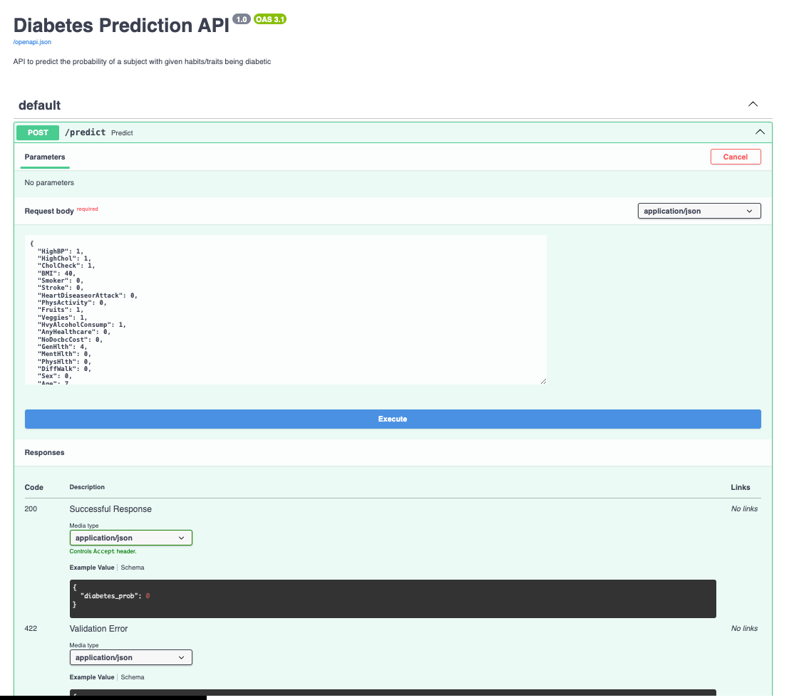

# Dataset description and attributions

The dataset used in this project is [CDC Diabetes Health Indicators](https://archive.ics.uci.edu/dataset/891/cdc+diabetes+health+indicators) originally coming from Kaggle [Diabetes Health Indicators Dataset](https://www.kaggle.com/datasets/alexteboul/diabetes-health-indicators-dataset) which in turn is a modified and cleaned-up version of the [Behavioral Risk Factor Surveillance System](https://www.kaggle.com/datasets/cdc/behavioral-risk-factor-surveillance-system) dataset.  
UCI version is used for the ease of access through the use of `ucimlrepo` package.

The Diabetes Health Indicators Dataset contains healthcare statistics and lifestyle survey information about people in general along with their diagnosis of diabetes. The 35 features consist of some demographics, lab test results, and answers to survey questions for each patient. The target variable for classification is whether a patient has diabetes, is pre-diabetic, or healthy. It is a binary classification problem since diabetes and pre-diabetes belong to the same category marked as positive (1), and non-diabetes as negative (0)

# Project Goal

The goal is to better understand the relationship between lifestyle and diabetes in the US.  
The task itself is a classification task with the target variable being whether a patient has diabetes, is pre-diabetic, or healthy. The stretch goal is the ability to predict if a person has diabetes without testing them for it, but rather from a quick phone chat or even filling out a form online.

# Reproduce the project

## Environment setup

I prefer to use conda because it comes with a python interpreter of the specified version whereas with the other options like pipenv, poetry etc you need a base interpreter of a required version.
If you don't want to use conda, you can as well just skip the conda environment setup and use the provided Pipfile.* to reproduce the environment or just create virtual environment of your choice (eg python's built-in `venv`), and install the dependencies using the provided [requirements.txt](requirements.txt). In the latter case you need to keep in mind that the base interpreter's python version must be 3.10 and that 100% reproducibility is likely to be achieve but is not guaranteed.

Below are instructions for conda

1. Clone this repo

1. Create a clean Python 3.10 based environment and activate it
    ```shell
    conda create -n ml-zoomcamp-midterm-alex python=3.10
    conda activate ml-zoomcamp-midterm-alex
    ```

1. Install requirements
    ```shell
    pip install -r requirements.txt 
    ```

## Running the [notebook.ipynb](notebook.ipynb)

I usually run jupyter notebooks using Visual Studio Code but if it's not the IDE of your choice you can spin up a jupyter server and use your browser, using the following command

```shell
jupyter notebook
```

> Please note that to see [Evidently](https://www.evidentlyai.com/) Reports that this notebook features, you need to either run it yourself or render it on [nbviewer](https://nbviewer.org/), it doesn't render on GitHub for some reason

Below is a link to the notebook on nbviewer:
https://nbviewer.org/github/aaalexlit/ml_zoomcamp_midterm_cdc_diabetes/blob/main/notebook.ipynb

## Training the final model

The final model is trained on all the available data wiht the hyperparameters obtained via fine-tuning in the [notebook.ipynb](notebook.ipynb).  
To run the final model training execute

```shell
python train.py
```

## Model deployment

Model is deployed using [FastAPI](https://fastapi.tiangolo.com/)

To run the model locally (in the same pipenv environment that it'd run in Docker container) execute:

```shell
pipenv run python predict.py
```

That will spin up uvicorn server on port 8000 (make sure it's not occupied)

The api can be tested right from the built-in Swagger UI that can be found on 
http://127.0.0.1:8000/docs



or by executing the following curl from the command line:

```shell
curl -X 'POST' \
  'http://127.0.0.1:8000/predict' \
  -H 'accept: application/json' \
  -H 'Content-Type: application/json' \
  -d '{
  "HighBP": 1,
  "HighChol": 1,
  "CholCheck": 1,
  "BMI": 40,
  "Smoker": 0,
  "Stroke": 0,
  "HeartDiseaseorAttack": 0,
  "PhysActivity": 0,
  "Fruits": 1,
  "Veggies": 1,
  "HvyAlcoholConsump": 1,
  "AnyHealthcare": 0,
  "NoDocbcCost": 0,
  "GenHlth": 4,
  "MentHlth": 0,
  "PhysHlth": 0,
  "DiffWalk": 0,
  "Sex": 0,
  "Age": 7,
  "Education": 3,
  "Income": 8
}'
```

## Containerized version of the service

To build and spin the service docker container up run:

```shell
docker compose up --build
```


Then in this instance to test the service you can do it through the UI available on  
(Note the port difference comparing to the local version!!!)

http://localhost/docs

or by running the following curl:

```shell
curl -X 'POST' \
  'http://localhost/predict' \
  -H 'accept: application/json' \
  -H 'Content-Type: application/json' \
  -d '{
  "Age": 7,
  "AnyHealthcare": 0,
  "BMI": 40,
  "CholCheck": 1,
  "DiffWalk": 0,
  "Education": 3,
  "Fruits": 1,
  "GenHlth": 4,
  "HeartDiseaseorAttack": 0,
  "HighBP": 1,
  "HighChol": 1,
  "HvyAlcoholConsump": 1,
  "Income": 8,
  "MentHlth": 0,
  "NoDocbcCost": 0,
  "PhysActivity": 0,
  "PhysHlth": 0,
  "Sex": 0,
  "Smoker": 0,
  "Stroke": 0,
  "Veggies": 1
}'
```

To clean up after stopping the container run

```shell
docker compose down
```

## Deployment to AWS EBS

```shell
eb init -i
eb local run --port 80
eb create diabetes-prediction-env
```

Terminate the service

```shell
eb terminate diabetes-prediction-env
```

[AWS EBS service deployment - Watch Video](https://www.loom.com/share/9afeab38ed0d470ba1776a3b01ab12be?sid=183778ce-b742-472d-9e8e-0b1ceffeb37c)